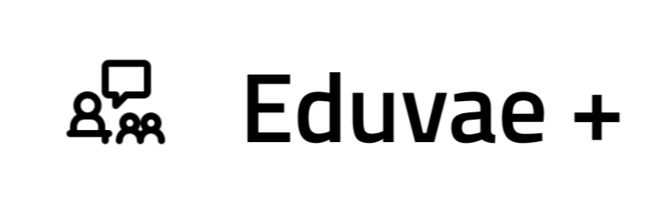
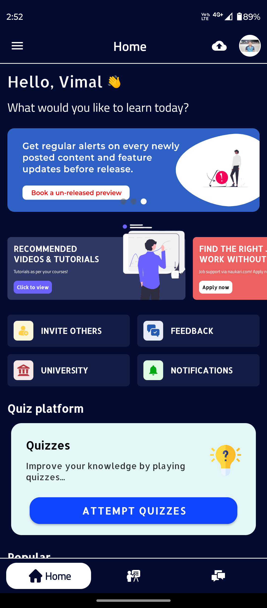
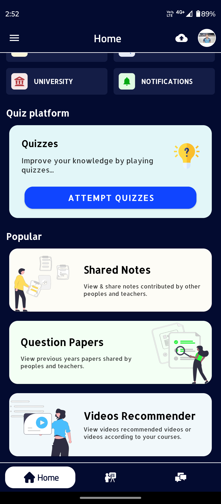
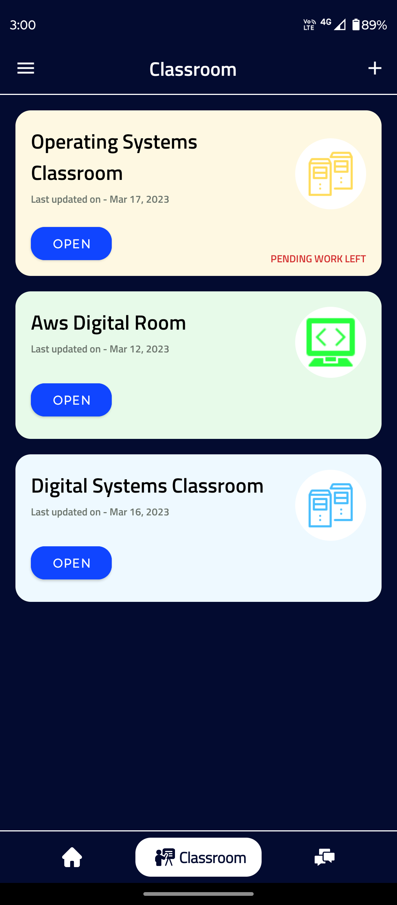
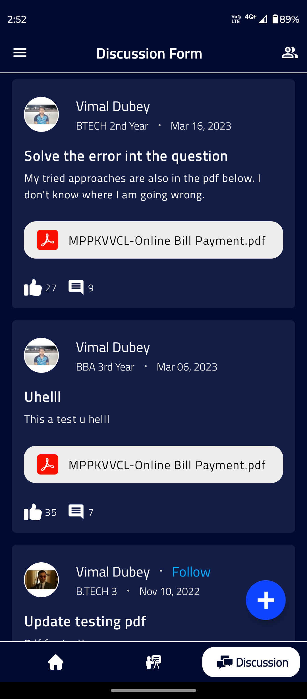

<h1 align="center">
 <br>
 
 <br>
 Eduvae Plus Education App
 <br>
</h1>

<h4 align="center">Download the latest android release application build.</h4>

<p align="center">
 <a href="https://drive.google.com/file/d/1Qho2jY1abDxGWi-FM-6BBqKymv_ZeShK/view?usp=drive_link">
    
 </a>
 <a href="https://github.com/thisisvd/FitMe-App/blob/master/support/application/Fitme-android-v1.3.6-b6-release.apk">
    
 </a>
</p>

<p align="center">
 <a href="#introduction">Introduction</a> •
 <a href="#objective-and-usage">Objective and Usage</a> •
 <a href="#screenshots">Screenshots</a> •
 <a href="#project-sources">Project Sources</a> •
 <a href="#diagrams">Diagrams</a> •
 <a href="#how-to-use">How to use</a> •
 <a href="#tech-stack">Tech Stack</a> •
 <a href="#license">License</a>
</p>

## Introduction
The idea for this project originated from the challenges we observed, both personally and from other students at our college. Students often had to visit multiple websites to find essential learning materials, such as previous year’s question papers, syllabus, exam timetables, and more. This time-consuming process was a significant drain on students' precious time. To address this, we decided to develop an application that would serve as a one-stop platform for all of a student's academic needs.

## Objective and Usage
We aim to create a mobile application that provides educational services to students through their mobile devices, using the Android OS platform. This application will offer students a variety of features in a single app, including access to their syllabus, study notes, previous year’s question papers, and quizzes to help them improve their knowledge. Students will also be able to upload notes to assist other students.

Additionally, the app will allow administrators to create and manage classrooms for specific subjects, with features for assignment submissions and leaderboards for submissions. A new feature, Video Recommender, will suggest educational videos based on the user’s selected courses. The app will also include a discussion forum where users can share problems and solutions.

## Screenshots
<p float="left">





</p>

## Project Sources

 - [Application](https://drive.google.com/drive/folders/17WpqFYxPEzxlJEsMjxS9Feiv9jysQIZY?usp=drive_link)
 - [Project Screenshots](https://drive.google.com/drive/folders/1f7jg--98C5vtm6z1yfbfMTcrPfb7Xyjx?usp=drive_link)
 - [Project]()

## How to use
  - Clone the project on your system.
```bash
git clone https://github.com/thisisvd/Eduvae-plus.git
```
  - Sync the project, build it and run it.
  - Then, in the `local.properties` file, obtain the keys from the relevant API sites and replace them below.
```bash
# API Key's
BASE_YOUTUBE_API_KEY=***
```

## Diagrams

Use Case Diagram


DFD Diagram


Sequence Diagram


## Tech Stack

`Client:` 


## Other Dependencies and all

MVVM (Model-View-View-Model), ROOM Database, Retrofit, Navigation, Glide.

## License

[Apache 2.0 License](https://github.com/thisisvd/Eduvae-plus/blob/master/LICENSE)

## Copyright

© 2025 Eduvae Plus Education App. All rights reserved.
